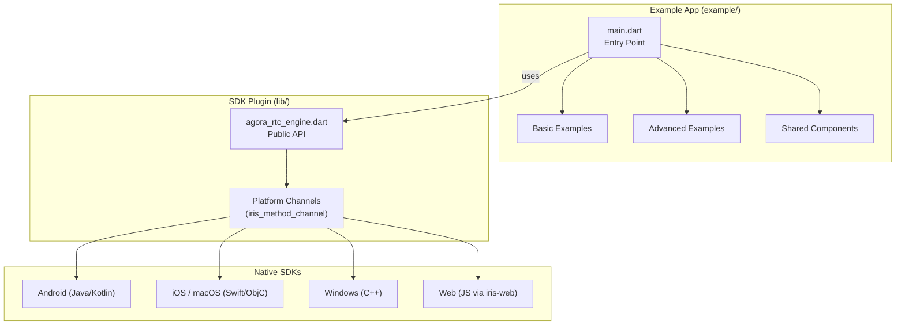
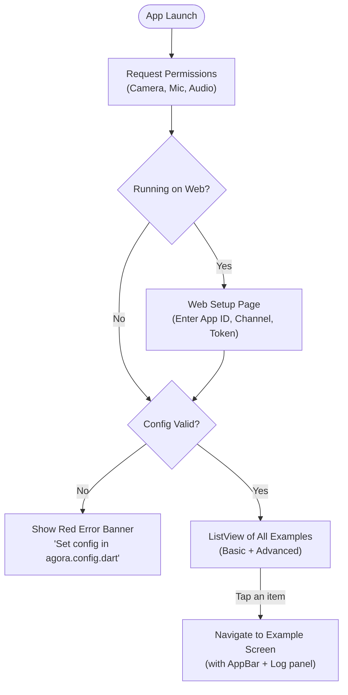
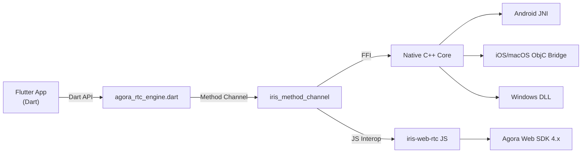

# Agora RTC Engine — Project Deep-Dive Analysis

## What Is This Project?

This is the **Agora RTC Engine Flutter SDK v6.5.2** — a Flutter plugin that wraps the [Agora Video SDK](https://docs.agora.io/en/Interactive%20Broadcast/product_live?platform=All%20Platforms), enabling **real-time voice and video communication** inside Flutter apps. The `example/` folder is a standalone Flutter demo app showcasing every major SDK capability.

> [!IMPORTANT]
> The SDK is **cross-platform**: Android, iOS, macOS, Windows, and Web (alpha).

---

## High-Level Architecture

---

## Project Structure

| Path | Purpose |
|------|---------|
| `lib/` | SDK source — Dart API, platform channels, FFI bindings |
| [example/lib/main.dart](file:///c:/Users/Manish/develop/projects/agora_rtc_engine-6.5.2/example/lib/main.dart) | Example app entry point — lists all demos |
| [example/lib/config/agora.config.dart](file:///c:/Users/Manish/develop/projects/agora_rtc_engine-6.5.2/example/lib/config/agora.config.dart) | Agora credentials (App ID, Token, Channel ID) |
| `example/lib/examples/basic/` | 3 basic demos |
| `example/lib/examples/advanced/` | 32 advanced demos |
| `example/lib/components/` | 9 reusable UI/utility widgets |
| `android/`, `ios/`, `macos/`, `windows/`, `web/` | Platform-specific plugin code |

---

## How the Example App Works

1. **Permissions** — On Android, requests camera, microphone, and audio permissions at startup.
2. **Config Validation** — Checks that `appId`, `token`, and `channelId` are not the default placeholder values.
3. **Example List** — A flat `ListView` built from `basic` + `advanced` lists, with grey section headers.
4. **Navigation** — Tapping an item pushes a new `Scaffold` with the demo widget and a floating log panel.

---

## Feature Catalog

### Basic Examples (3)

| # | Example | What It Does |
|---|---------|-------------- |
| 1 | **JoinChannelAudio** | Join a channel for **audio-only** calling |
| 2 | **JoinChannelVideo** | Join a channel for **video** calling (camera preview + remote view) |
| 3 | **StringUid** | Join a channel using a **string-based** user ID instead of integer |

### Advanced Examples (32)

| # | Example | What It Does |
|---|---------|--------------|
| 1 | **AudioEffectMixing** | Mix audio effects & background music during a call |
| 2 | **AudioSpectrum** | Visualize audio frequency spectrum in real-time |
| 3 | **ChannelMediaRelay** | Relay media streams across different channels |
| 4 | **CustomCaptureAudio** | Capture audio from a custom source (not the mic) |
| 5 | **DeviceManager** | List/select audio & video input/output devices (desktop) |
| 6 | **EnableSpatialAudio** | Enable 3D spatial audio effects |
| 7 | **EnableVirtualBackground** | Apply virtual background (blur, image, video) |
| 8 | **JoinMultipleChannel** | Join multiple channels simultaneously |
| 9 | **MediaPlayer** | Play a media file and share it into the channel |
| 10 | **MediaRecorder** | Record the call's audio/video locally |
| 11 | **MusicPlayer** | Play DRM-protected music (mobile only) |
| 12 | **PreCallTest** | Test network quality & device setup before joining (desktop) |
| 13 | **ProcessAudioRawData** | Access & process raw audio frames via native bridge |
| 14 | **ProcessVideoRawData** | Access & process raw video frames via native bridge |
| 15 | **PushAudioFrame** | Push custom audio frames into the channel |
| 16 | **PushVideoFrame** | Push custom video frames into the channel |
| 17 | **RtmpStreaming** | Push the call to an RTMP stream (live to YouTube/Twitch etc.) |
| 18 | **ScreenSharing** | Share your screen with other participants |
| 19 | **SendMetadata** | Send metadata alongside media streams |
| 20 | **SendMultiCameraStream** | Stream from multiple cameras at once |
| 21 | **SendMultiVideoStream** | Send multiple video streams simultaneously |
| 22 | **SetBeautyEffect** | Apply beauty filters (smoothing, whitening, etc.) |
| 23 | **SetContentInspect** | Enable content moderation / inspection |
| 24 | **SetEncryption** | Encrypt media streams for secure communication |
| 25 | **SetVideoEncoderConfiguration** | Configure video resolution, frame rate, bitrate |
| 26 | **SpatialAudioWithMediaPlayer** | 3D spatial audio combined with media player |
| 27 | **StartDirectCDNStreaming** | Stream directly to a CDN without Agora servers |
| 28 | **StartLocalVideoTranscoder** | Combine multiple video sources into one stream |
| 29 | **StartRhythmPlayer** | Play a rhythm beat (for music collaboration) |
| 30 | **StreamMessage** | Send arbitrary data messages over the channel |
| 31 | **TakeSnapshot** | Capture a snapshot of the video stream |
| 32 | **VoiceChanger** | Apply voice effects (deep, high, reverb, etc.) |

---

## Shared Components

| Component | Purpose |
|-----------|---------|
| [log_sink.dart](file:///c:/Users/Manish/develop/projects/agora_rtc_engine-6.5.2/example/lib/components/log_sink.dart) | Floating log panel (shows SDK events, errors) |
| [config_override.dart](file:///c:/Users/Manish/develop/projects/agora_rtc_engine-6.5.2/example/lib/components/config_override.dart) | Runtime override of App ID / Token / Channel |
| [basic_video_configuration_widget.dart](file:///c:/Users/Manish/develop/projects/agora_rtc_engine-6.5.2/example/lib/components/basic_video_configuration_widget.dart) | UI for adjusting video resolution, FPS, orientation |
| [remote_video_views_widget.dart](file:///c:/Users/Manish/develop/projects/agora_rtc_engine-6.5.2/example/lib/components/remote_video_views_widget.dart) | Dynamically renders remote participants' video views |
| [stats_monitoring_widget.dart](file:///c:/Users/Manish/develop/projects/agora_rtc_engine-6.5.2/example/lib/components/stats_monitoring_widget.dart) | Displays real-time call quality stats (bitrate, jitter, etc.) |
| [example_actions_widget.dart](file:///c:/Users/Manish/develop/projects/agora_rtc_engine-6.5.2/example/lib/components/example_actions_widget.dart) | Common action buttons reused across examples |
| [dump_video_action.dart](file:///c:/Users/Manish/develop/projects/agora_rtc_engine-6.5.2/example/lib/components/dump_video_action.dart) | Debug tool to dump raw video frames |
| [rgba_image.dart](file:///c:/Users/Manish/develop/projects/agora_rtc_engine-6.5.2/example/lib/components/rgba_image.dart) | Renders raw RGBA image data as a Flutter widget |
| [android_foreground_service_widget.dart](file:///c:/Users/Manish/develop/projects/agora_rtc_engine-6.5.2/example/lib/components/android_foreground_service_widget.dart) | Wraps widgets with Android foreground service support |

---

## Configuration

Defined in [agora.config.dart](file:///c:/Users/Manish/develop/projects/agora_rtc_engine-6.5.2/example/lib/config/agora.config.dart):

| Key | Description |
|-----|-------------|
| `appId` | Your Agora App ID from [Agora Console](https://console.agora.io/) |
| `token` | Temporary token for authentication |
| `channelId` | Name of the channel to join |
| `uid` | Integer user ID (default `0` = auto-assigned) |
| `screenSharingUid` | Separate UID for screen sharing stream (`10`) |
| `stringUid` | String-based user ID for the StringUid example |

---

## SDK Plugin Architecture

The SDK uses a **unified native layer** called **Iris** that wraps Agora's C++ RTC engine. Each platform has a thin bridging layer. The Flutter side calls through `iris_method_channel` using FFI (native) or JS interop (web).

---

## Key Dependencies

| Package | Purpose |
|---------|---------|
| `agora_rtc_engine` | The core SDK (path dependency to parent `../`) |
| `permission_handler` | Request camera/mic permissions |
| `path_provider` | Access device file system paths |
| `cupertino_icons` | iOS-style icons |

---

## Summary

This project is a **comprehensive demo/reference app** for the Agora RTC Engine Flutter SDK. It demonstrates every major real-time communication feature — from basic audio/video calls to advanced capabilities like screen sharing, virtual backgrounds, RTMP streaming, encryption, raw data processing, multi-camera/multi-channel support, and spatial audio. It's designed as a learning tool and API reference for developers integrating Agora into their Flutter apps.
